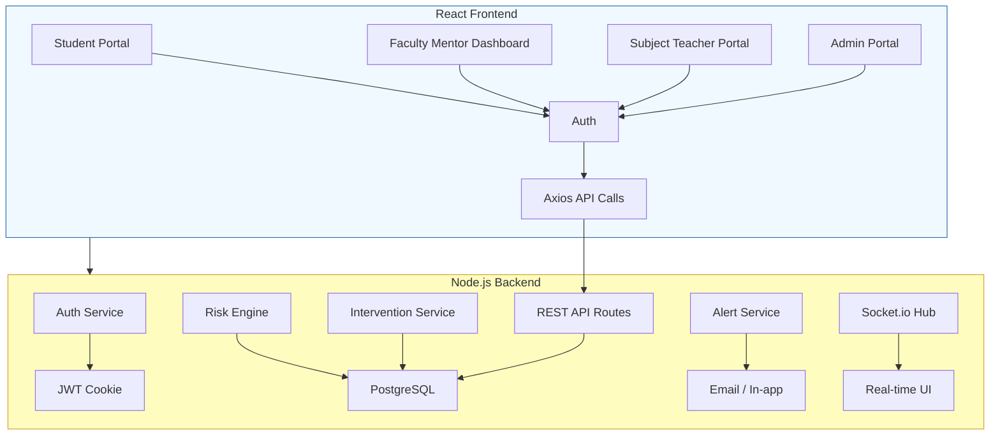
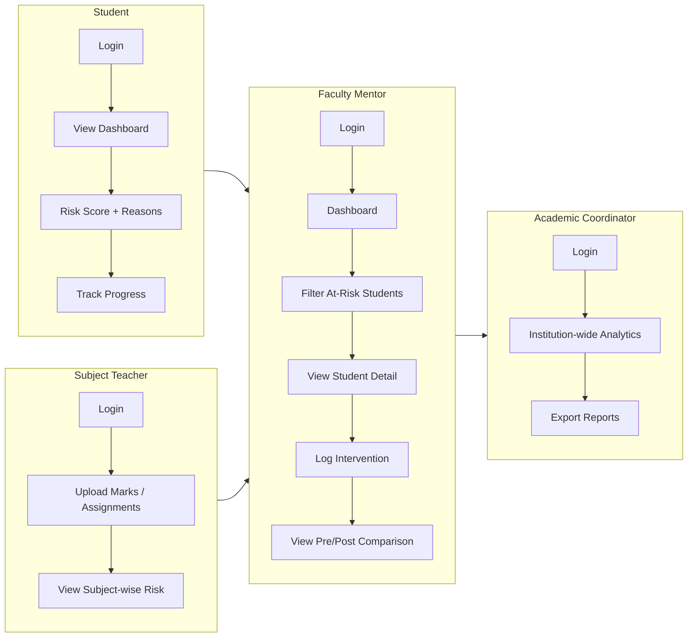

# CampusIQ – Early Academic Risk Detection & Student Intervention Platform

---

## 1. Problem Statement & Explanation

### 1.1 Problem Statement
Universities and colleges often identify academically at‑risk students **too late**. Critical indicators such as:
- Declining attendance
- Low internal marks
- Missed assignments
- Irregular LMS activity
are **scattered** across multiple legacy systems and are manually reviewed. Faculty mentors rely on delayed reports or subjective judgment, leading to late interventions (counselling, remedial classes). By the time risk is flagged, student performance and morale have already suffered.

### 1.2 Why This Is Critical
- **Student outcomes** degrade when interventions are delayed.  
- **Faculty workload** increases due to manual data aggregation.  
- **Institutional reputation** suffers due to higher dropout and lower graduation rates.

A **unified, real‑time monitoring system** is needed to continuously analyse academic signals, detect early risk trends, and provide **explainable** reasons for each risk score, empowering proactive support.

---

## 2. Solution Overview

**CampusIQ** is a web‑based, full‑stack platform that:
1. **Aggregates** attendance, marks, assignment completion, and LMS activity into a single data lake.
2. **Computes** a multi‑factor risk score for every student using a weighted algorithm.
3. **Explains** the top‑contributing factors (e.g., low attendance, missing assignments).
4. **Shows** an actionable dashboard for faculty mentors to filter by class, subject, and risk level.
5. **Allows** mentors to log interventions (counselling, remedial class, assignment extension) with remarks.
6. **Tracks** pre‑ and post‑intervention performance to measure effectiveness.
7. **Sends** automated alerts (email + in‑app) to mentors when a student crosses a high‑risk threshold.
8. **Exports** risk summaries as PDF/CSV for reporting.

---

## 3. Approach & Methodology

| Phase | Activities |
|-------|------------|
| **Requirement Analysis** | Gather stakeholder needs (students, mentors, teachers, coordinators). |
| **Design** | Architecture design (micro‑service style), UI/UX wireframes, risk‑scoring model definition. |
| **Implementation** | Backend (Node.js/Express, PostgreSQL, Socket.io). Frontend (React‑Vite, Tailwind, Recharts). |
| **Testing** | Unit tests for risk engine, integration tests for API endpoints, UI flow testing with Cypress. |
| **Deployment** | Dockerised containers, CI/CD pipeline using GitHub Actions. |
| **Feedback Loop** | Pilot with a department, collect metrics, refine scoring weights. |

---

## 4. Architecture Overview



- **Frontend**: React + Vite, Tailwind CSS, Recharts for analytics, Socket.io client for real‑time notifications.
- **Backend**: Express.js, JWT (httpOnly cookies), PostgreSQL, risk‑engine service, Socket.io server, Nodemailer for alerts, node‑cron for scheduled risk recomputation.
- **Data Layer**: 15‑table relational schema (users, students, attendance, marks, assignments, interventions, alerts, etc.).

---

## 5. Tech Stack

| Layer | Technology |
|-------|------------|
| **Frontend** | React (Vite), Tailwind CSS v4, Recharts, Axios, React‑Router‑DOM v6, Socket.io client |
| **Backend** | Node.js, Express.js, JWT, bcrypt, Multer, Socket.io, node‑cron, Nodemailer |
| **Database** | PostgreSQL (SQL) |
| **DevOps** | Docker, GitHub Actions CI/CD, npm scripts |
| **Testing** | Jest (backend), Cypress (frontend) |
| **Design** | Google Fonts – Inter, modern dark‑mode palette, glass‑morphism cards, micro‑animations |

---

## 6. Core Features

1. **Academic Risk Score Generation** – Weighted scoring (Attendance 40 %, Marks 35 %, Assignment Completion 25 %).
2. **Explainable Insights** – Top‑3 contributing factors displayed with colour‑coded badges.
3. **Faculty Dashboard** – Filter by class, subject, risk level; sortable tables; charts (risk distribution, trend over time).
4. **Student Self‑Portal** – Personal risk score, suggested actions, progress tracker.
5. **Intervention Logging** – Mentor can add counselling, remedial class, assignment extension with remarks; timestamps stored.
6. **Pre‑/Post‑Intervention Comparison** – Graphs showing risk before and after the logged action.
7. **Automated Alerts** – Email & in‑app notifications when risk > 80 % or before major exams.
8. **Export Reports** – PDF/CSV generation for department‐level analytics.

---

## 7. User Flow Diagram



---

## 8. Database Snapshot (Key Tables)

| Table | Primary Purpose |
|-------|-----------------|
| `users` | Auth, role (student, mentor, teacher, admin) |
| `students` | Profile, class, section |
| `attendance` | Daily attendance records |
| `marks` | Internal assessment scores |
| `assignments` | Assignment metadata & submissions |
| `lms_activity` | LMS login / content view logs |
| `risk_scores` | Computed risk score + timestamp |
| `interventions` | Mentor‑logged actions and remarks |
| `alerts` | Notification queue for real‑time alerts |

---

## 9. API Overview (selected endpoints)

- `POST /api/auth/login` – Returns JWT cookie.
- `GET /api/students/:id/risk` – Current risk score & top factors.
- `GET /api/mentor/at‑risk?class=&subject=&level=` – Filtered list.
- `POST /api/interventions` – Log new intervention.
- `GET /api/interventions/:studentId` – History + pre/post scores.
- `GET /api/reports/summary?format=pdf|csv` – Downloadable report.

All routes are protected by **roleGuard** middleware.

---

## 10. Deployment & Run‑Book

1. **Clone repository**
   ```bash
   git clone <repo-url>
   cd Tarkshastra
   ```
2. **Setup database** (PostgreSQL ≥13)
   ```bash
   psql -U postgres -c "CREATE DATABASE campusiq;"
   cd server && npm run migrate && npm run seed
   ```
3. **Environment variables** – copy `.env.example` to `.env` and adjust credentials.
4. **Run backend**
   ```bash
   cd server && npm start   # runs on PORT (default 5000)
   ```
5. **Run frontend**
   ```bash
   cd client && npm install && npm run dev   # http://localhost:5173
   ```
6. **Production** – use Docker compose (provided in `docker-compose.yml`).

---

## 11. Future Enhancements

| Idea | Benefit |
|------|---------|
| **AI‑driven suggestions** – Use LLM to suggest personalised study plans. |
| **Mobile App** – Native iOS/Android client for push notifications. |
| **Integration with SIS** – Pull data automatically from existing Student Information Systems. |
| **Advanced Analytics** – Cohort‑level predictive modelling, churn prediction. |
| **Role‑based UI theming** – Dark mode per role, custom branding per department. |

---

## 12. Conclusion

CampusIQ provides a **single pane of glass** for academic risk monitoring, turning fragmented data into actionable insights. By delivering **explainable risk scores**, **real‑time alerts**, and a **closed‑loop intervention workflow**, the platform empowers mentors to intervene early, improves student outcomes, and reduces administrative overhead.

---

*Prepared on 2026‑04‑18*
